# Autoencoders with CNNs

## 1. "mnist" dataset

### Training, validation and testing datasets

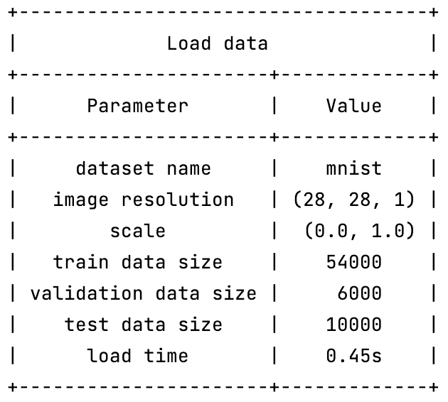

### Building and compiling model

  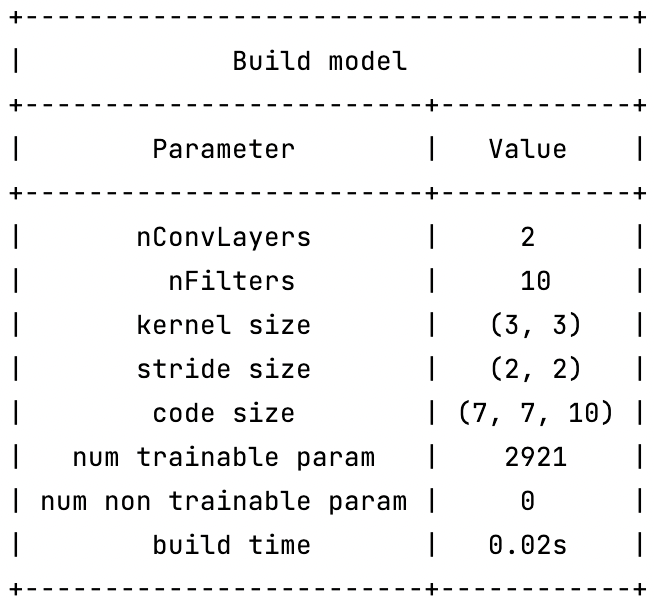
  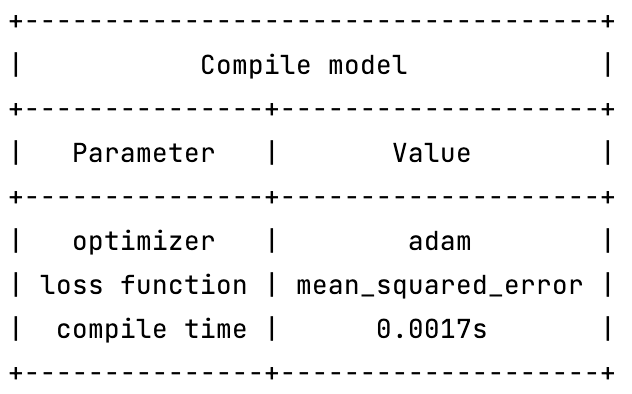

### Autoencoder training

Training parameters and loss functions obtained durig training.

  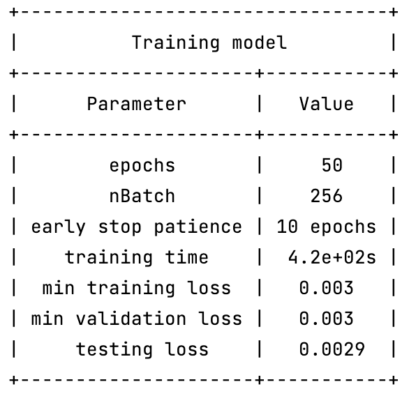
  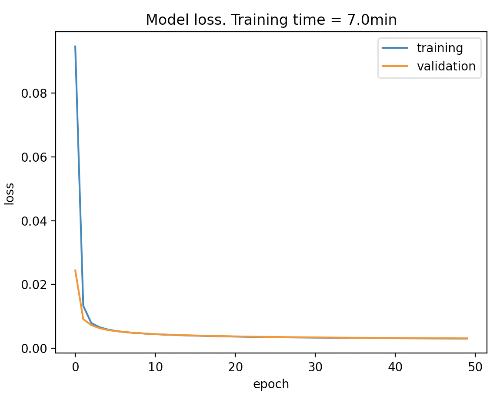

### Prediction results

Results obtained using the autoencoder. First row corresponds to the original
image and second row are the recevered image after being passed through
the autoencoder.

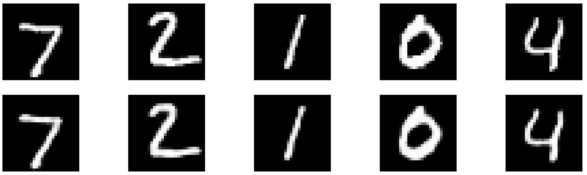

### Code visulaisation

The code is the condensed information after the input image is passed throguh the 
encoder. In this example the code has a shape (7x7x10) and can be visualised in the 
figure below. Each row corresponds to the 10 filters (columns) of each of the 5 images
shown in the figure above (7, 2, 1, 0 and 4).

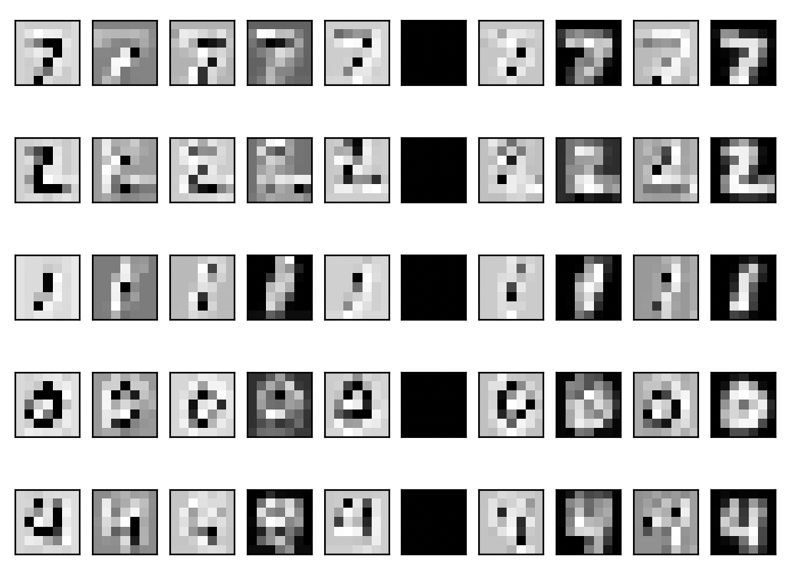

## 2. "afreightdata" dataset

### Training, validation and testing datasets

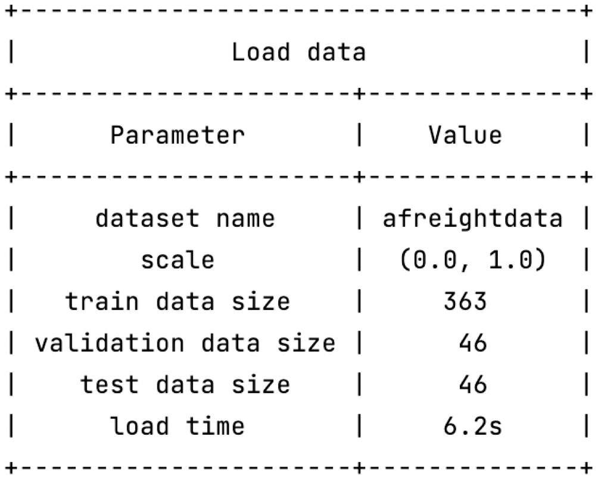

### Building and compiling model

  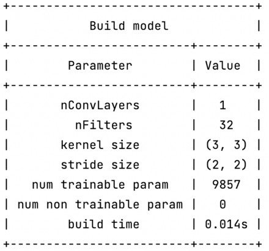
  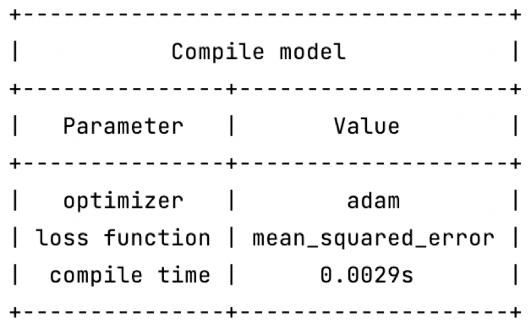

### Autoencoder training

Training parameters and loss functions obtained durig training.

  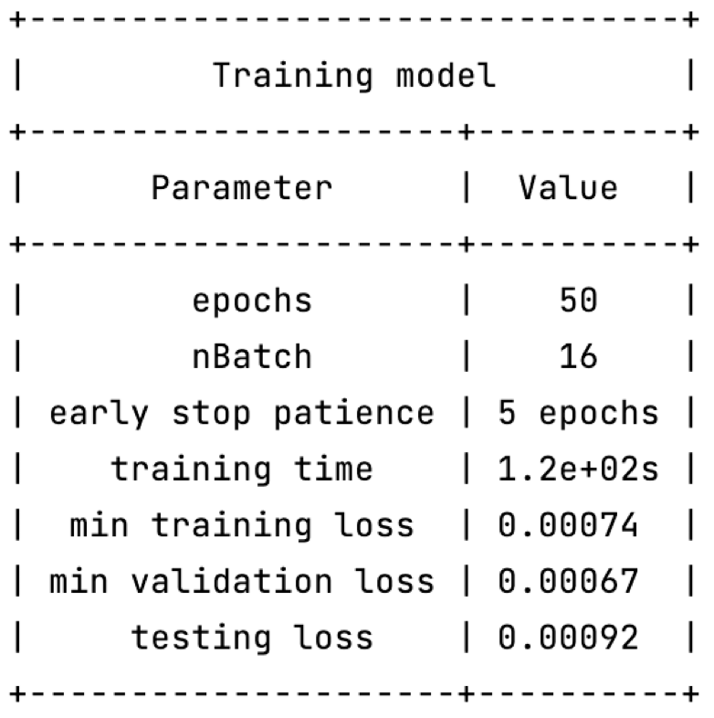
  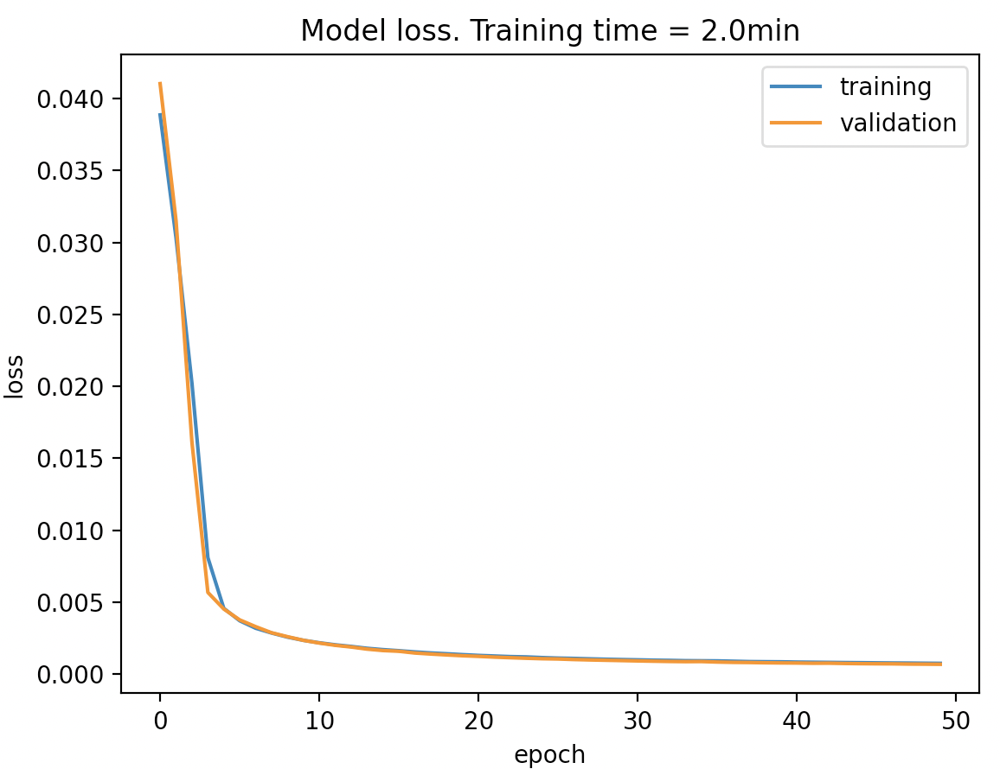

### Prediction results

Results obtained using the autoencoder. First row corresponds to the original
image and second row are the recevered image after being passed through
the autoencoder.

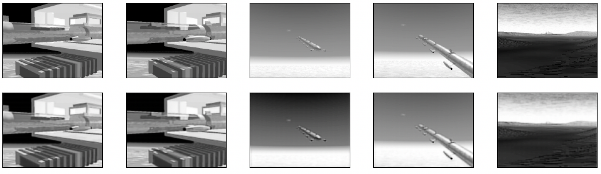