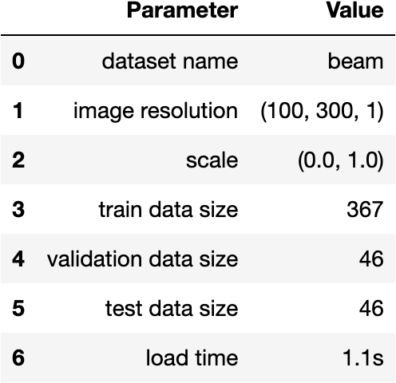
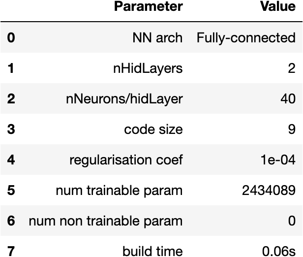
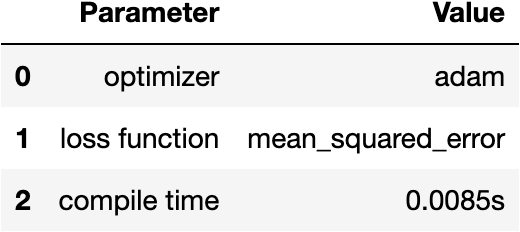
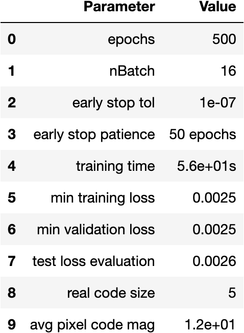
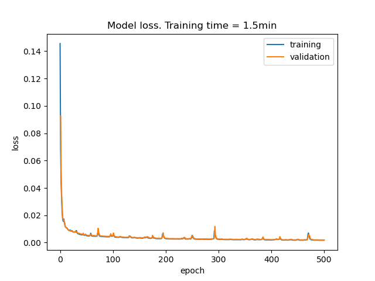
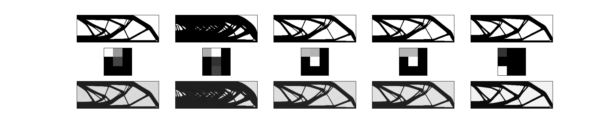

# Autoencoders with CNNs

## 1. "beam" dataset

### Training, validation and testing datasets

### Building and compiling model

  
  

### Autoencoder training

Training parameters and loss functions obtained durig training.

  
  

### Prediction results

Results obtained using the autoencoder. 

First row corresponds to the original
image and last row are the recevered image after being passed through
the autoencoder. The middle row corresponds to the latent space (code) representaion, where the
information is compressed preserving the accuracy.

