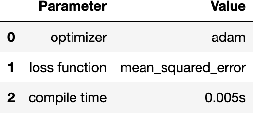

# Autoencoders in a physical-driven problem

## Inputs

Each dataset is defined by its directory name and is located in the `datasets` folder.

Each dataset must contain all images for trainind, validation and testing.

Implemented inputs are:

* PNG images

* TXT files with the following information (in the same directory):
    
    1. `Th.msh` file containing the mesh information
        | 1st column     | 2n column      | 3rd column  | 
        | ------------- | ------------- | --------    |
        | nNodes        | nElems         | nBoundEdges   |
        | x_1         | y_1         | edgeID_1   |
        | :         | :         | :   |
        | x_nNodes         | y_nNodes| edgeID_nNodes   |
        | n1_1         | n2_1        | n3_1  |
        | :         | :         | :   |
        | n1_nElems| n2_nElems | n3_nElems |
        | e_n1_1         | e_n2_1         | e_boundID_1   |
        | :         | :         | :   |
        | e_n1_nBoundEdges | e_n2_nBoundEdges| e_boundID_nBoundEdges|

        First, a block of length `nNodes` with nodal positions x and y for each node in the mesh (x, y, edgeID).

        Second a block of length `nElems` with connectivity matrix, nodes in each element (node1, node2, node3).

        Thrid a block of length `nBoundEdges` with information of each boundary edge; (node1, node2, boundID).

    2. `xxx.txt` files with element values (solution with P0, constant values in each element). This files must be all related to the same mesh in `Th.msh`

        | 1st column     | 2n column      | 3rd column  | 4th column  | 5th column  | 
        | ------------- | ------------- | --------    | --------    | --------    |
        | nElems        |          |    |
        | u_1         | u_2         | u_3   | u_4   | u_5   |
        | :         | :         | :   | :   | :   |
        | ...         | ...         | ...   | ...   | u_nElems   |
         

### FCNN

FCNN architecture for the `beam_homog_x4` dataset

- Input layer - 80x160 = 12800 neurons - 0 train params
- Hidden layer - 200 neurons - 200*12800 + 200 = 2560200 train params
- Hidden layer - 200 neurons - 200*200 + 200 = 40200 train params
- Hidden layer - 200 neurons - 200*200 + 200 = 40200 train params
- Hidden layer - 200 neurons - 200*200 + 200 = 40200 train params
- Latent space (code) - max size 25 = 25*200 + 25 = 5025 train params
- Hidden layer - 200 neurons = 200*25 + 200 = 5200 train params
- Hidden layer - 200 neurons = 200*200 + 200 = 40200 train params
- Hidden layer - 200 neurons - 200*200 + 200 = 40200 train params
- Hidden layer - 200 neurons - 200*200 + 200 = 40200 train params
- Output layer - 80x160 = 12800 neurons - 12800*200 + 12800 = 2572800 train params

### CNN

CNN architecture for the `beam_homog_x4` dataset

- Input layer - 80x160x1 = 12800 neurons - 0 train params
- Conv layer with 20 filters of kernel 3 - 80x160x20 (each of the 20 filters is 3x3) - 20x9 + 20 = 200 train params
- MaxPol layer with stride 2 - 40x80x20 - 0 train params
- Conv layer with 20 filters of kernel 3 - 40x80x20 (each of the 20 filters is 3x3) - 180x20 + 20 = 3620 train params
- MaxPol layer with stride 2 - 20x40x20 - 0 train params
- Hidden layer - 20x40x20 = 16000 neurons - 0 train params
- Hidden layer - 400 neurons - 400*16000 + 400 = 6400400 train params
- Hidden layer - 400 neurons - 400*400 + 400 = 160400 train params
- Latent space (code) - max size 25 - 25*400 + 25 = 10025 train params
- Hidden layer - 400 neurons = 400*25 + 400 = 10400 train params
- Hidden layer - 400 neurons = 400*400 + 400 = 160400 train params
- Hidden layer - 20x40x20 = 16000 neurons - 16000*400 + 16000 = 6416000 train params
- Transposed conv layer with 20 filters, kernel 3 and stride 2 - 40x80x20 - 20x9x20 + 20 = 3620 train params
- Transposed conv layer with 20 filters, kernel 3 and stride 2 - 80x160x20 - 20x9x20 + 20 = 3620 train params
- Output layer - 80x160x1 = 12800 neurons - 20x9 + 1 = 181 train params

# Results

## 1. "beam_homog_x4" dataset

### Training, validation and testing datasets

### Building and compiling model

  
  

### Autoencoder training

Training parameters and loss functions obtained durig training.

  
  

### Prediction results

Results obtained using the autoencoder. 

First row corresponds to the original
image and last row are the recevered image after being passed through
the autoencoder. The middle row corresponds to the latent space (code) representaion, where the
information is compressed preserving the accuracy.

